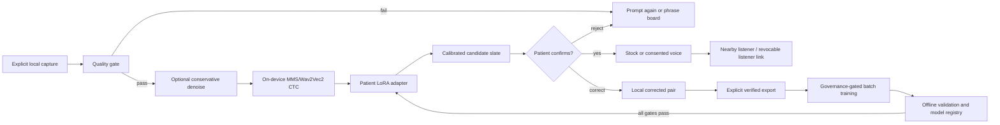

# Awaaz — Product Requirements and Delivery Plan

**Product:** NeuroTrace Awaaz  
**Document version:** 1.0  
**Date:** 2026-08-31  
**Working branch:** `codex/awaaz-contract-foundation`  
**Pull request:** [prabindersinghh/NeuroTraceV1#1](https://github.com/prabindersinghh/NeuroTraceV1/pull/1)  
**Document owner:** NeuroTrace product and engineering team  
**Clinical owner required before a patient pilot:** stroke neurologist and speech-language pathologist (SLP)

This is the handoff source of truth for what Awaaz is intended to become, why the work was
sequenced this way, what has actually been implemented, and what evidence is still missing.
The supplied “AWAAZ master build prompt” is treated as product/research input, not as proof
that any feature, model, dataset, clinical result, or regulatory status exists.

---

## 1. Executive summary

Awaaz is an on-device-first communication assistant for adults with post-stroke dysarthria
and, with stricter confirmation rules, aphasia. Its job is to help a patient express their
own intended message. It is not a diagnostic system, a substitute for an SLP, or a system
that invents fluent text on the patient's behalf.

The product starts with a reliable, offline phrase board because it provides value before
any model is trained. Patient-specific speech recognition is then added behind consent,
data-integrity, privacy, evaluation, and deployment gates. The primary product outcome is
listener intelligibility and successful communication—not a benchmark WER claim.

The code on the current PR branch includes the phrase-board safety foundation, local
consented audio-pair workflow, emergency playback, listener-link contracts, a governance-
gated LoRA ASR training runtime, and a synthetic-only offline policy-evaluation scaffold.
It does **not** include a trained patient model, patient cohort, clinical validation, or
approved production model deployment.

## 2. Status vocabulary

Every requirement and roadmap item uses one of these labels.

| Label | Meaning |
|---|---|
| **BASE REPOSITORY** | Present before the current Awaaz branch; not necessarily deployed. |
| **PR BRANCH** | Implemented, tested, committed, and pushed to PR #1; not merged or clinically released. |
| **LOCAL FIX** | Present in the working tree but not yet committed/pushed at this document revision. |
| **PLANNED** | Designed or researched but not implemented. |
| **BLOCKED** | Must not proceed without the named data, governance, clinical, security, or operational prerequisite. |
| **RESEARCH ONLY** | May be evaluated offline; cannot support a product or clinical claim. |

“Implemented” means code exists. It does not mean medically validated, production deployed,
or safe for unsupervised patient use.

## 3. Problem and product hypothesis

Post-stroke motor-speech impairment can leave a person with intact intent but speech that an
unfamiliar listener cannot understand. Conventional ASR is usually trained on typical speech
and can replace acoustically uncertain content with fluent but incorrect text. For a person
with aphasia, a system that predicts a sentence can go further and create a message the
person never intended.

The hypothesis is that an acoustically faithful, patient-adapted recognizer plus an explicit
confirmation loop can improve communication with unfamiliar listeners. A phrase board and
emergency phrase remain available when recognition is unavailable or wrong.

### 3.1 Product principles

1. **The patient owns the message.** Suggestions are never presented as patient speech until
   the patient confirms them.
2. **Dysarthria and aphasia are different safety cases.** Dysarthria-dominant speech may use
   tightly gated auto-speak; aphasia-dominant, mixed, or unassessed profiles always confirm.
3. **A safe floor precedes ML.** The offline phrase board and emergency path must work even
   when the model, network, or browser speech service fails.
4. **Acoustic fidelity beats plausible fluency.** Decoder and reranker changes must not hide
   uncertainty by producing a more grammatical but wrong sentence.
5. **Consent is specific and revocable.** Communication, training, voice cloning, research,
   and cross-patient learning are separate purposes.
6. **No fabricated evidence.** Synthetic runs, scaffolds, and untrained weights are labelled
   explicitly and cannot produce clinical claims.

## 4. Scope

### 4.1 MVP scope

- Adults with chronic, clinically stable post-stroke dysarthria.
- Patient, linked caregiver, SLP/clinician, and temporary listener-link experiences.
- Existing UI languages: English, Hindi, and Punjabi.
- Initial model pilot: one launch language selected only after cohort and data review, with
  code-switch behaviour measured rather than assumed.
- Offline phrase board, emergency phrase, and local capture/export.
- Patient-specific CTC/LoRA ASR evaluated offline before any on-device release.
- Explicit correction and confirmation loop.

### 4.2 Phase-two scope

- Aphasia support using candidate presentation and mandatory confirmation.
- Personal stock voice and, separately, explicitly consented voice cloning.
- Conversation-aware candidate reranking after acoustic-model safety is established.
- Federated or cross-patient learning as a separate research protocol.

### 4.3 Non-goals

- Acute stroke detection or emergency diagnosis.
- Medical diagnosis, prognosis, clinical scoring, or treatment recommendations.
- Automatic completion of an aphasic patient's thought.
- Hidden recording, passive raw-audio upload, or background cloud inference.
- Training on caregiver feedback as though it were patient intent.
- Online reinforcement-learning exploration with patients.
- Claiming “emotion detection” from speech.
- Replacing an SLP, neurologist, caregiver, or emergency service.

## 5. Users and stakeholders

| Stakeholder | Need | Design consequence |
|---|---|---|
| Patient | Communicate with little effort and retain authorship | Large targets, slow interaction, manual stop, confirmation, undo, offline floor |
| Caregiver | Configure phrases and support practice without speaking for the patient | Linked authorization, clear consent actor, separate caregiver feedback |
| Listener | Understand the patient's confirmed message without installing an app | Expiring, revocable, least-data browser link |
| SLP | Assess appropriateness, phrasing, burden, and intelligibility | Review protocol, phrase-set governance, human-listener evaluation |
| Neurologist | Confirm cohort safety and exclusions | Clinical protocol and adverse-event escalation |
| ML engineer | Reproduce training without seeing identity in logs | Pinned isolated runtime, opaque IDs, signed receipt, private manifests |
| Security/privacy owner | Prove purpose limitation, deletion, and restore behaviour | Data inventory, audit events, tombstones, recovery drills |

## 6. Safety model

### 6.1 Speech-profile rules

| Profile | May show candidates | May speak after confirmation | May auto-speak |
|---|---:|---:|---:|
| Dysarthria-dominant | Yes | Yes | Only if enabled and above a validated threshold |
| Aphasia-dominant | Yes | Yes | Never |
| Mixed | Yes | Yes | Never |
| Unassessed | Yes | Yes | Never |

The repository centralizes this decision in `may_auto_speak(...)` and tests the aphasia
invariant across the confidence range. Production thresholds still require prospective
validation.

### 6.2 Universal hard constraints

- Display recognized content as uncertain until confirmed.
- Preserve manual card selection and typed correction at all times.
- Never trigger emergency action from ASR alone.
- Never auto-dial; the emergency control may open a dialer with the number prefilled.
- Do not use caregiver acceptance/rejection as a patient reward signal.
- A low-confidence or out-of-distribution result falls back to candidates or the phrase
  board; it does not become more fluent through a strong language prior.
- Deleting consented media records a tombstone that must also be applied after a restore.
- Voice cloning is a separate, high-risk capability and is not required for MVP usefulness.

## 7. Core user journeys

### 7.1 Immediate communication without a model — PR BRANCH

1. Patient opens a cached EN/HI/PA phrase board.
2. Patient selects a card.
3. The app speaks through an available local/browser voice and records text-only usage
   metadata when connected.
4. If the network is unavailable, the board stays useful and clearly labels unsaved state.

### 7.2 Practice and consented learning pair — PR BRANCH

1. Patient or authorized caregiver starts an explicit practice capture.
2. A bounded 16 kHz WAV remains in origin-scoped local storage.
3. The patient selects the exact intended card or approves a correction.
4. The server receives metadata and a content hash, not audio bytes.
5. A separate export verifies each WAV and creates a sensitive local training archive.
6. The user receives a warning that exported media has left protected app storage.

### 7.3 Personalized recognition — PLANNED/BLOCKED

1. Patient presses and holds or explicitly starts recording.
2. On-device capture performs quality checks; conservative enhancement can be bypassed.
3. An on-device CTC model produces tokens and calibrated uncertainty.
4. A patient-specific LoRA adapter proposes text or a small candidate set.
5. The patient confirms, corrects, rejects, or falls back to a phrase card.
6. Only confirmed text may be spoken or sent to a listener link.
7. The event contract records the candidate slate and policy probability without raw audio,
   transcript text, or patient identity in analytics.

### 7.4 Listener link — PR BRANCH contract, PLANNED live ASR source

1. An authorized user creates one language-pinned, expiring link.
2. The listener sees only confirmed utterances plus brief communication coaching.
3. A replacement link invalidates the previous capability.
4. Stop sharing revokes access immediately; unknown, expired, and revoked links converge to
   the same public response.

### 7.5 Emergency floor — PR BRANCH

1. Patient activates a persistent control or guarded long-press.
2. A previously recorded local WAV begins before a network request.
3. The UI can open the phone dialer with India's `108` number prefilled.
4. Location is requested only with explicit emergency opt-in.
5. The interface reports notification or call state truthfully; it never claims a connected
   call merely because a dialer opened.

## 8. Functional requirements and acceptance criteria

| ID | Requirement | Acceptance criterion | Status |
|---|---|---|---|
| AWA-FR-001 | Offline phrase board | Previously loaded, user-bound cards render after transport failure; auth failures clear them | PR BRANCH |
| AWA-FR-002 | Phrase management | Authorized roles add/remove normalized, supported-language cards; emergency floor cannot be removed | PR BRANCH |
| AWA-FR-003 | Local practice capture | Bounded WAV stays local; server contract stores metadata/hash only; explicit deletion works | PR BRANCH |
| AWA-FR-004 | Verified training export | Archive verifier checks schema, safe paths, UUID relations, WAV headers, sizes, and hashes without extracting | PR BRANCH |
| AWA-FR-005 | Speech-profile safety | Aphasia, mixed, and unassessed profiles cannot auto-speak at any confidence | PR BRANCH |
| AWA-FR-006 | Emergency playback | Setup, self-test, local storage, offline playback, cancellation, and dialer handoff are explicit | PR BRANCH |
| AWA-FR-007 | Listener capability | URL is language-pinned, expiring, replaceable, revocable, and contains no patient identity/history/audio | PR BRANCH |
| AWA-FR-008 | Endpointing | Manual stop remains default; optional silence timeout is 0.5–4.0 s and begins only after speech | PR BRANCH |
| AWA-FR-009 | Training governance | Real training refuses unsigned/expired/wrong-purpose/wrong-hash receipts and unavailable local weights | PR BRANCH |
| AWA-FR-010 | Leakage-safe split | Test phrases never appear in training; multi-patient research also separates speaker groups | PR BRANCH runtime |
| AWA-FR-011 | Patient-adapted ASR | Train a real Wav2Vec2/MMS CTC LoRA adapter only from a consented verified archive | BLOCKED |
| AWA-FR-012 | On-device inference | Signed approved adapter runs without raw-audio cloud transfer and meets device targets | PLANNED |
| AWA-FR-013 | Confirmation loop | Candidate, reject, correction, fallback, and speak actions work with switch/keyboard access | PARTIAL |
| AWA-FR-014 | Privacy-safe policy events | Opaque IDs, full slate, action, propensity, policy version, confirmation outcome; no text/audio/identity | Synthetic scaffold only |
| AWA-FR-015 | Deletion propagation | Media, adapter, backup, export, and restored-copy deletion are evidenced end to end | PLANNED/BLOCKED |
| AWA-FR-016 | Voice output | Stock voice works first; cloned voice requires separate consent, provenance, watermark/risk review, and deletion | PLANNED |

## 9. Technical architecture and planned pipeline

### 9.1 Stage decisions

| Stage | Selected direction | Why | Current status |
|---|---|---|---|
| Capture | Phone first; ESP32 evaluated only for a dedicated accessory | Reduces hardware dependency during patient discovery | Phone path PR BRANCH; ESP32 RESEARCH ONLY |
| Enhancement | RNNoise/noisereduce candidates, bypassable and A/B evaluated | Denoising can erase impaired-speech cues | PLANNED |
| Acoustic features | Use for QA/research, not “emotion” or diagnosis | openSMILE features can support analysis but add license and claim risk | RESEARCH ONLY |
| Base ASR | Maintained Hugging Face MMS/Wav2Vec2 CTC integration | CTC supports acoustic fidelity; fairseq reference is archived | Runtime PR BRANCH; weights BLOCKED |
| Adaptation | PEFT LoRA over a local base checkpoint | Small patient adapter and controlled update surface | Executable runtime PR BRANCH; real training BLOCKED |
| Decoding | Low language-prior weight, calibrated alternatives | Avoid fluent-but-wrong substitutions | PLANNED evaluation |
| Context rerank | Phrase/context candidates only after acoustic baseline passes | Helpful context must not invent intent | PLANNED |
| Confirmation | Mandatory except validated dysarthria-only high-confidence case | Preserves authorship | Contract PR BRANCH; full ASR UI PLANNED |
| TTS | Stock voice first; clone later | Product works without biometric impersonation risk | Stock partial; clone BLOCKED |
| Distribution | Nearby audio plus least-data listener link | Supports real conversation without listener install | Link contract PR BRANCH |

### 9.2 ASR runtime already built on the PR branch

`backend/app/ml/train/asr_runtime/` contains a real in-memory 16 kHz PCM training path for
Wav2Vec2/MMS CTC plus PEFT LoRA. It deliberately fails closed before expensive imports unless
all governance and integrity checks pass. It requires:

- a signed, purpose-specific, time-bounded governance receipt;
- the exact archive and base-model SHA-256 values bound into that receipt;
- an integrity-verified local archive and local `safetensors` checkpoint;
- exact pinned dependency versions;
- a phrase-disjoint split, and a speaker-disjoint split for pooled research;
- a private output directory and an atomic publication step.

Its synthetic smoke mode creates a private manifest only. It creates no model and no clinical
metric. The current runtime contract pins NumPy 1.26.4, PyTorch 2.4.1, Transformers 4.44.2,
PEFT 0.12.0, Accelerate 0.34.2, and Safetensors 0.4.5. These are reproducibility pins, not
recommendations that they remain current; upgrades require a deliberate compatibility,
privacy, and deterministic-smoke cycle.

### 9.3 Known open runtime findings — BLOCKED before real training

The current tests prove the implemented contracts, but an adversarial review identified
seven unresolved weaknesses. They are not waived by the fact that training is presently
unreachable:

1. The governance receipt uses a symmetric HMAC; an operator who holds the verification key
   can also mint approval. Replace it with an approval/signing boundary the training operator
   cannot self-authorize.
2. The synthetic smoke output path is not covered by the same containment guard as real
   output.
3. Split construction has disjointness checks but no minimum train/validation/test size or
   statistical adequacy floor.
4. `epochs_completed` can overstate a partially completed/truncated epoch.
5. Adapter publication has a window in which a model can be orphaned between publication
   steps; make registry/pointer publication atomic.
6. The sanitizer does not yet cover every possible `target_text` path.
7. A base-model snapshot may pass through shared system temporary storage; use a private,
   contained training-run directory throughout.

These findings are also tracked in `docs/COMPLETION_CHECKLIST.md` and
`docs/PLAN_AWAAZ.md`. Real training and every downstream model claim remain blocked until
they are fixed, reviewed, and regression-tested.

## 10. Data, consent, and training plan

### 10.1 Required data classes

| Data | Location | Retention | Purpose |
|---|---|---|---|
| Phrase-board text | App/backend | Until edited/deleted | Immediate communication |
| Local practice WAV | Patient device | Explicit, bounded, deletable | Patient-selected training pair |
| Audio receipt metadata/hash | Backend | Policy-defined | Integrity, consent, deletion evidence |
| Exported training archive | User-controlled local path | User-controlled; prominently warned | Human-controlled training handoff |
| Training private manifest | Isolated training host | Run retention policy | Reproducibility without transcript/identity logs |
| LoRA adapter | Encrypted model registry/device | Versioned; deletable | Patient-specific recognition |
| Policy event | Backend analytics | Minimum necessary | Offline evaluation; no text/audio/identity |

### 10.2 Consent boundaries

Separate consent records are required for:

1. storing a local practice recording;
2. exporting it from protected app storage;
3. training a patient-specific adapter;
4. retaining and deploying that adapter;
5. using data in pooled or federated research;
6. creating and using a cloned voice;
7. sending confirmed text to a listener link.

Caregiver assistance must record the actor but cannot silently substitute caregiver consent
for patient consent where the patient is capable of deciding. Capacity, assent, proxy
authority, withdrawal, and re-consent need a clinician/ethics-approved protocol.

### 10.3 Split and evaluation rules

- Normalize phrase text before grouping.
- Keep phrase groups disjoint across train, validation, and test.
- For multi-patient research, keep patient/speaker groups disjoint as well.
- Freeze the test set and evaluate only after training decisions are locked.
- Stratify by speaker, language, impairment severity, phrase type, device, and noise.
- Do not compare phrase-board WER with open-conversation WER as though they were the same
  task.
- Do not publish results from synthetic or standard-speech data as patient-performance
  evidence.

### 10.4 Training and release gates

Real training remains blocked until every item below has named ownership and evidence.

- Approved protocol, consent language, and data-processing notice.
- Consented cohort and verified local archive.
- SLP-approved prompts and participant burden limits.
- Licensed, locally pinned base model and reproducible environment.
- Pre-registered split and listener-evaluation plan.
- Privacy/security review, deletion path, encrypted backup, and restore drill.
- Baseline stock model, personalized model, and phrase-board fallback comparison.
- Model card and data sheet generated from real run artifacts.
- Independent go/no-go review before any adapter reaches a patient device.

## 11. Offline policy optimization / “RL” plan

The current work is **not online RL** and must not be described as autonomous learning from
patients. It is an offline contextual-policy evaluation scaffold under
`backend/app/ml/rl/`.

It currently supports synthetic, privacy-safe events, inverse-propensity diagnostics,
self-normalized IPS, deterministic bootstrap intervals, and hard safety gates. It forbids
online exploration, emergency events, generated text, changes to confirmation policy,
speech triggering, caregiver feedback as patient reward, deployment, and clinical claims.

Before any real offline evaluation, product logging must capture the full offered candidate
slate, chosen action, known logging propensity, policy version, and patient confirmation or
fallback outcome. Existing interaction logs that lack propensity cannot support causal
off-policy claims. Doubly robust estimators may be added only after a separately validated
outcome model exists.

## 12. Evaluation plan

### 12.1 Primary outcomes

- Percentage of intended words understood by unfamiliar human listeners.
- Successful communication of the intended message.
- Communication time and number of repair turns.
- Patient-confirmed semantic fidelity.
- Patient adoption, continued use, and burden.

### 12.2 Engineering outcomes

- WER and CER on a locked, phrase-disjoint test set.
- Candidate recall at K, calibration error, abstention rate, correction rate, and fallback
  rate.
- Real-time factor, end-to-end latency, memory, package size, battery, and crash-free rate.
- Performance by language, code-switch type, severity, device class, microphone, and noise.
- Denoise bypass comparison to detect erased speech cues.

WER/CER are internal engineering measures. They are not substitutes for listener
intelligibility or evidence of clinical benefit.

### 12.3 Human-listener study outline

1. Pre-register phrases, speaker/phrase split, primary endpoint, exclusions, and analysis.
2. Recruit unfamiliar listeners and separately track familiar caregivers.
3. Randomize and blind listeners to raw speech, baseline ASR, personalized ASR, and phrase
   board output where feasible.
4. Ask listeners to transcribe or select intended content; record time and confidence.
5. Have the patient confirm whether the communicated meaning was correct.
6. Report individual participants and failure cases, not only an aggregate mean.
7. Obtain ethics and clinical approval before recruitment.

## 13. Non-functional requirements

| Area | Requirement / target |
|---|---|
| Offline reliability | Phrase board and configured emergency WAV work without a network after setup |
| Latency | ASR interaction target under 1 s; hard product review above 2 s |
| Capture | 16 kHz mono PCM contract; explicit quality rejection and manual stop |
| Privacy | Raw communication audio stays on device unless an explicit purpose-specific export/upload exception is approved |
| Accessibility | Large targets, high contrast, audio prompts, one-hand use, keyboard/switch paths, reduced motion |
| Security | Least privilege, opaque public capabilities, signed artifacts, safe archive paths, no executable model formats |
| Observability | No patient IDs, transcript text, phrase text, audio hashes, secrets, or local sensitive paths in normal logs |
| Reproducibility | Pinned code/config/dependencies, deterministic seeds where supported, artifact hashes, immutable model versions |
| Reliability | Atomic adapter publication, live/frozen pointers, rollback, backup and restore drills |
| Localization | English/Hindi/Punjabi UI reviewed by native speakers and SLP; no machine-only medical copy approval |

## 14. Security, privacy, and recovery

- The repo-level `data/` location is the only approved data root; raw and export directories,
  legacy backend data paths, sensitive archives, and model weights are gitignored and tested.
- Patient identifiers and sensitive local paths must not appear in stdout/stderr, metrics,
  model cards, issue text, or CI artifacts.
- Use `safetensors`; reject path traversal, symlinks, hardlinks, executable pickle checkpoints,
  unbounded files, and hash mismatches.
- Encrypt training archives and model backups with keys held separately from storage.
- Maintain immutable adapter bundles plus explicit `live` and `frozen-reference` pointers.
- Replay deletion tombstones after every restore before a restored system serves data.
- Follow the RPO/RTO and quarterly restore-drill design in `docs/ML_RECOVERY.md`.
- A source-code Git branch/bundle is not a backup of patient data, registry state, model
  weights, or consent evidence.

## 15. Regulatory and clinical-governance posture

Awaaz currently makes no diagnosis or treatment claim. Final classification depends on
intended use, claims, deployment, and jurisdiction and requires qualified legal/regulatory
review. The engineering plan should be assessed against:

- India's [Digital Personal Data Protection Act, 2023](https://www.meity.gov.in/static/uploads/2024/06/2bf1f0e9f04e6fb4f8fef35e82c42aa5.pdf)
  and the notified [Digital Personal Data Protection Rules, 2025](https://www.meity.gov.in/documents/act-and-policies/digital-personal-data-protection-rules-2025-gDOxUjMtQWa).
- CDSCO's [Medical Devices and Diagnostics](https://www.cdsco.gov.in/opencms/opencms/en/Medical-Device-Diagnostics/Medical-Device-Diagnostics/)
  materials and current medical-device-software guidance, where applicable.
- FDA/Health Canada/MHRA's [Good Machine Learning Practice principles](https://www.fda.gov/medical-devices/software-medical-device-samd/good-machine-learning-practice-medical-device-development-guiding-principles).
- [NIST AI Risk Management Framework 1.0](https://www.nist.gov/publications/artificial-intelligence-risk-management-framework-ai-rmf-10).
- [DECIDE-AI](https://www.nature.com/articles/s41591-022-01772-9) for early live clinical
  evaluation, [CONSORT-AI](https://doi.org/10.1038/s41591-020-1034-x) for randomized trial
  reporting, and [TRIPOD+AI](https://www.bmj.com/content/385/bmj-2023-078378) if a prediction
  model is later evaluated.

Compliance language in a document is not compliance evidence. Required evidence includes a
data map, consent records, retention/deletion execution, access review, incident process,
model change control, human-factors evaluation, and a signed intended-use decision.

## 16. Delivery roadmap and gates

### Phase 0 — contract foundation — PR BRANCH

- Offline trilingual phrase board and management.
- Speech-profile confirmation invariant.
- Local consented capture, review, deletion, and verified export.
- Emergency local WAV and dialer handoff.
- Expiring/revocable listener capability.
- Leakage-safe cohort planning and archive verifier.
- Governance-gated ASR LoRA runtime.
- Synthetic offline policy-evaluation scaffold.
- Truthful synthetic model artifacts and recovery plan.

**Exit:** branch tests pass, security/privacy review findings are resolved, and PR is merged.

### Phase 1 — governance and runtime readiness — PLANNED

- Name product, clinical, privacy, security, ML, and field-study owners.
- Approve intended use, cohort, exclusions, consent, phrase set, and adverse-event process.
- Select the one-language pilot and acquire an approved local base checkpoint.
- Build an encrypted private artifact/model registry and run a restore drill.
- Benchmark phone capture, RNNoise/noisereduce bypass, MMS, and Whisper baselines.

**Go/no-go:** no patient capture until protocol, consent, and deletion are approved.

### Phase 2 — consented offline pilot — BLOCKED

- Recruit a small clinically characterized cohort through an approved protocol.
- Collect bounded prompted practice recordings; do not start with passive conversation.
- Train per-patient LoRA adapters in the isolated runtime.
- Run phrase-disjoint, listener-based evaluation and failure review.

**Go/no-go:** advance only if semantic fidelity and listener outcomes improve without an
unacceptable false-fluency, burden, privacy, or subgroup failure pattern.

### Phase 3 — controlled on-device deployment — PLANNED

- Convert/quantize the approved base and adapter path for target Android devices.
- Verify parity, signature, rollback, deletion, latency, memory, battery, and offline use.
- Release under supervised field testing with phrase-board fallback always visible.

**Go/no-go:** clinical, privacy, security, and product owners sign the release evidence.

### Phase 4 — prospective field evaluation — PLANNED

- Evaluate unfamiliar-listener intelligibility, successful communication, time, retention,
  burden, failure cases, and adverse events.
- Report per-participant and subgroup outcomes under the appropriate reporting guideline.

### Phase 5 — pooled/federated research — RESEARCH ONLY

- Consider only after the individual-patient system is useful and governable.
- Require separate research consent, secure aggregation/threat model, speaker-disjoint
  evaluation, and protection against one participant's update changing another patient's
  voice or intended-message behaviour.

## 17. Resource registry — repositories and implementation assets

License entries are planning notes, not legal advice. Verify the exact revision and LICENSE
file before distributing a combined product.

| Resource | Intended role | Adoption decision / risk |
|---|---|---|
| [fairseq MMS examples](https://github.com/facebookresearch/fairseq/tree/main/examples/mms) | Original MMS training/inference reference | **Research reference only.** The parent fairseq repository was archived/read-only in March 2026; do not make it the production runtime dependency. MIT at the referenced repo; verify model licenses separately. |
| [Hugging Face Transformers MMS](https://huggingface.co/docs/transformers/en/model_doc/mms) | Maintained Wav2Vec2/MMS CTC integration | **Selected runtime direction.** Pin a specific local checkpoint, code revision, language adapter, and license. |
| [timsainb/noisereduce](https://github.com/timsainb/noisereduce) | Spectral-gating denoise baseline | **Benchmark only.** Every experiment needs an unprocessed bypass because denoise can remove impaired-speech cues. Verify MIT revision. |
| [iver56/audiomentations](https://github.com/iver56/audiomentations) | Training augmentation | **Planned offline use.** Keep a clean validation/test set and log every transform. MIT. |
| [atomic14/esp32_audio](https://github.com/atomic14/esp32_audio) | Optional ESP32 capture/accessory prototypes | **Research only.** Phone-first MVP; verify hardware, firmware, security, and exact repository license before reuse. |
| [audeering/openSMILE](https://github.com/audeering/opensmile) | Acoustic QA/research features | **License gate.** The open-source version is not freely licensed for a commercial product; obtain commercial terms or replace it. Do not infer emotion/diagnosis. See [license note](https://audeering.github.io/opensmile/about.html). |
| [huggingface/peft](https://github.com/huggingface/peft) | LoRA patient adapters | **Selected training library.** Apache-2.0; version is pinned in the isolated runtime. |
| [xiph/rnnoise](https://github.com/xiph/rnnoise) | Low-latency neural noise suppression candidate | **Benchmark only**, with bypass and impaired-speech intelligibility evaluation. BSD-3-Clause. |
| [openai/whisper](https://github.com/openai/whisper) | Strong general-ASR comparison baseline | **Benchmark, not selected patient runtime.** Measure fluent substitutions and device footprint. Code and model weights are MIT per the repository. |
| [PyTorch](https://github.com/pytorch/pytorch) | Training framework | Selected isolated trainer dependency; pin CPU/CUDA/MPS build and verify deterministic behaviour. |
| [Hugging Face Accelerate](https://github.com/huggingface/accelerate) | Reproducible training/device orchestration | Pinned runtime dependency; no managed external telemetry or hub upload. |
| [safetensors](https://github.com/huggingface/safetensors) | Non-executable model artifacts | Selected. Continue rejecting pickle-based checkpoint loading. |
| [ONNX Runtime mobile](https://onnxruntime.ai/docs/tutorials/mobile/) | Candidate Android inference runtime | Planned benchmark after an approved model exists; parity and operator coverage are gates. |
| [jiwer](https://github.com/jitsi/jiwer) | WER/CER computation | Candidate engineering metric utility; normalization rules must be pre-registered. |

## 18. Research registry

### 18.1 Speech recognition and adaptation

| Resource | Why it matters | How Awaaz will use it |
|---|---|---|
| [Scaling Speech Technology to 1,000+ Languages / MMS](https://arxiv.org/abs/2305.13516) | Multilingual speech representations and CTC models | Base-model candidate; validate target-language and dysarthric-speech behaviour locally |
| [Robust Speech Recognition via Large-Scale Weak Supervision / Whisper](https://arxiv.org/abs/2212.04356) | Large weakly supervised general ASR | Comparison baseline and failure analysis, not proof of dysarthric accuracy |
| [wav2vec 2.0](https://proceedings.neurips.cc/paper/2020/hash/92d1e1eb1cd6f9fba3227870bb6d7f07-Abstract.html) | Self-supervised speech representation learning | Technical basis for Wav2Vec2/MMS CTC runtime |
| [Connectionist Temporal Classification](https://mlanthology.org/icml/2006/graves2006icml-connectionist/) | Alignment-free sequence training | Basis for acoustically faithful CTC output |
| [LoRA](https://arxiv.org/abs/2106.09685) | Parameter-efficient low-rank adaptation | Patient adapter strategy; validate target modules and overfitting |
| [Large-scale disordered-speech training study](https://arxiv.org/abs/2412.19315) | Evidence that adding disordered speech can improve prompted and conversational ASR without necessarily degrading standard benchmarks | Informs a future shared-model study; does not establish Awaaz efficacy or permit cross-patient use |
| [Federated learning for dysarthric ASR](https://arxiv.org/abs/2606.13253) | Recent UASpeech/TORGO federated adaptation results | Reproduce independently before considering Phase 5; paper results are not an Awaaz result |

The detailed layer-splitting, aggregation, privacy, and client-sampling choices of any
federated method must be reproduced from the paper/code and threat-modeled before adoption;
they are not requirements merely because they appeared in a source prompt.

### 18.2 Enhancement and acoustics

| Resource | Why it matters | Use constraint |
|---|---|---|
| [RNNoise paper](https://arxiv.org/abs/1709.08243) | Low-complexity recurrent noise suppression | Compare with raw speech and measure cue loss |
| [noisereduce paper](https://arxiv.org/abs/2412.17851) | Spectral-gating implementation and evaluation context | Baseline only; verify population and task mismatch |
| [openSMILE documentation](https://audeering.github.io/opensmile/) | Standardized acoustic feature extraction | Research/QA after license review; no emotion claim |

### 18.3 Clinical outcome and study design

| Resource | Why it matters | Use |
|---|---|---|
| [ASHA: Dysarthria in Adults](https://www.asha.org/practice-portal/clinical-topics/dysarthria-in-adults/) | Clinical framing, assessment, intelligibility, and participation context | SLP review baseline; not a substitute for a local protocol |
| [SLP estimation versus naïve-listener transcription](https://pubmed.ncbi.nlm.nih.gov/36009074/) | Supports direct listener-based intelligibility measurement rather than relying only on clinician estimates | Inform listener protocol |
| [DECIDE-AI](https://www.nature.com/articles/s41591-022-01772-9) | Reporting guidance for early live clinical AI evaluation | Phase 3/4 protocol and reporting checklist |
| [CONSORT-AI](https://doi.org/10.1038/s41591-020-1034-x) | AI intervention trial reporting extension | Use if a randomized interventional evaluation is conducted |
| [TRIPOD+AI](https://www.bmj.com/content/385/bmj-2023-078378) | Reporting of clinical prediction models | Use only if Awaaz later develops/evaluates a prediction model |

### 18.4 Offline policy evaluation

| Resource | Why it matters | Use |
|---|---|---|
| [Counterfactual Risk Minimization](https://proceedings.mlr.press/v37/swaminathan15.html) | Propensity-aware learning/evaluation from logged bandit feedback | Basis for the synthetic IPS policy scaffold |
| [Doubly Robust Policy Evaluation and Learning](https://arxiv.org/abs/1103.4601) | Combines reward model and propensity correction | Deferred until a validated outcome model exists |
| [Confident Off-Policy Evaluation and Selection through Self-Normalized Importance Weighting](https://arxiv.org/abs/2006.10460) | Self-normalization and uncertainty-aware selection | Supports conservative diagnostics, not automatic deployment |

## 19. Dataset registry

Public datasets support pretraining, baselines, and method development. They do not replace a
consented target cohort or establish performance for older Indian post-stroke patients.

| Dataset | Population/language | Proposed use | Key limitation / access note |
|---|---|---|---|
| [TORGO](https://www.cs.toronto.edu/~complingweb/data/TORGO/torgo.html) | English dysarthric and control speech | External dysarthric baseline and method reproduction | Small, English, population/device mismatch; follow access terms |
| [UASpeech](https://speechtechnology.web.illinois.edu/uaspeech/) | English isolated-word dysarthric speech | External personalized/federated baseline | Isolated-word task is not open conversation; access agreement applies |
| [Mozilla Common Voice](https://commonvoice.mozilla.org/en/datasets) | Crowdsourced typical speech including Hindi and Punjabi releases | Indic acoustic/language baseline or augmentation | Not post-stroke speech; verify release-specific CC0 terms and quality |
| [LibriSpeech / OpenSLR 12](https://www.openslr.org/12) | Read English speech | General-ASR smoke/baseline only | Large domain and population mismatch |
| [FLEURS](https://huggingface.co/datasets/google/fleurs) | Multilingual read speech | Cross-language evaluation tooling | Not dysarthric or conversational; verify dataset card/license |
| Local Awaaz cohort | Intended older Indian post-stroke speakers | Patient-specific training and primary evaluation | **MISSING/BLOCKED:** requires protocol, consent, characterization, secure storage, and SLP oversight |

Adjacent NeuroTrace datasets such as mPower or PhysioNet resources must not be silently
repurposed for Awaaz: their populations, consent, purpose, modalities, and licenses differ.

## 20. Risks and mitigations

| Risk | Impact | Mitigation / gate |
|---|---|---|
| Fluent but wrong transcript | Patient says something unintended | Low language prior, calibrated abstention, candidate display, confirmation, listener evaluation |
| Aphasia authorship violation | System invents intent | Never auto-speak for aphasia/mixed/unassessed; patient confirmation invariant |
| Denoise erases impaired-speech cues | Accuracy/intelligibility worsens silently | Raw bypass, cue-level and human-listener A/B evaluation |
| Small-data overfit/leakage | Misleading WER and unsafe deployment | Phrase- and speaker-disjoint frozen tests; per-participant reporting |
| Caregiver overrides patient | Loss of autonomy | Distinct roles, actor logging, patient confirmation, consent/capacity protocol |
| Voice clone misuse | Impersonation and biometric harm | Defer; separate consent/purpose, provenance, access, deletion, incident plan |
| Raw audio leaks through logs/artifacts/backups | Sensitive health/biometric exposure | Local-first data, log denial, safe formats, encrypted private storage, restore tombstones |
| Archived/unmaintained dependency | Supply-chain and maintainability risk | HF MMS production direction; fairseq as read-only reference |
| openSMILE commercial license conflict | Distribution/legal block | Commercial license or replacement before product integration |
| Device performance gap | Conversation becomes unusable | Quantization/parity/device matrix; <1 s target; phrase-board fallback |
| Public-dataset bias | Poor target-cohort performance | No transfer claim; collect and report a clinically characterized local cohort |
| Synthetic scaffold mistaken for evidence | False product/clinical claim | Required `synthetic` fields, model-card consistency tests, blocked claim flags |
| Online policy experiment harms patient | Unsafe change to candidate/confirmation behaviour | Offline-only policy work; no exploration/deployment capability |

## 21. Open decisions and blockers

1. Which single language and code-switch pattern define the first model pilot?
2. Which clinical partner and SLP own cohort criteria, severity measures, prompts, and
   communication outcomes?
3. What is the intended use and regulatory classification for the pilot and later product?
4. What consent/capacity/proxy process applies to aphasia and voice cloning?
5. Which approved MMS/Wav2Vec2 checkpoint and language adapter can be stored locally and
   distributed under acceptable terms?
6. What Android device floor, model size, latency, memory, and battery budget are binding?
7. Where will encrypted training archives, governance keys, adapters, and tombstones live?
8. What minimum listener-intelligibility improvement and maximum semantic-error rate form
   the model release gate?
9. Is openSMILE needed enough to justify a commercial license, or should the team use a
   simpler permissive feature pipeline?
10. Is voice cloning necessary for the clinical/product outcome, or should it remain out of
    scope until after a successful stock-voice pilot?

## 22. Definition of done

The Awaaz MVP is done only when all of the following are evidenced—not merely described:

- The phrase board and configured emergency phrase work offline on the target phone matrix.
- A consented, clinically characterized cohort and approved protocol exist.
- A real adapter is trained from a verified archive under a valid governance receipt.
- Frozen phrase/speaker-disjoint evaluation is complete.
- Unfamiliar-listener intelligibility and successful communication meet pre-registered
  thresholds without unacceptable semantic errors or subgroup failures.
- Confirmation/fallback/accessibility paths pass human-factors testing.
- On-device inference meets parity, latency, memory, battery, signature, rollback, and
  deletion requirements.
- Privacy, security, clinical, regulatory, and product owners sign the release evidence.
- Model card, data sheet, dependency manifest, SBOM, run hashes, limitations, and recovery
  drill are current.
- No clinical or deployment claim is derived from synthetic data, a scaffold, or a public
  dataset alone.

## 23. Handoff checklist

- Read this PRD, `docs/PLAN_AWAAZ.md`, `docs/PLAN_ML.md`, `docs/PLAN_RL.md`,
  `docs/ML_STATUS.md`, `docs/ML_RECOVERY.md`, `docs/DECISIONS.md`, and
  `docs/ARCHITECTURE.md`.
- Start from PR #1 and review commits individually; do not treat unmerged code as released.
- Run backend, frontend, privacy, migration, model-card consistency, ASR runtime, and offline
  policy suites before changing a gate.
- Never weaken a fail-closed check just to make a real training command run.
- Record new evidence and decisions in the repository, including who approved them and which
  artifact hash they cover.
- Keep research results, engineering metrics, product outcomes, and clinical claims in
  separate sections of every report.
